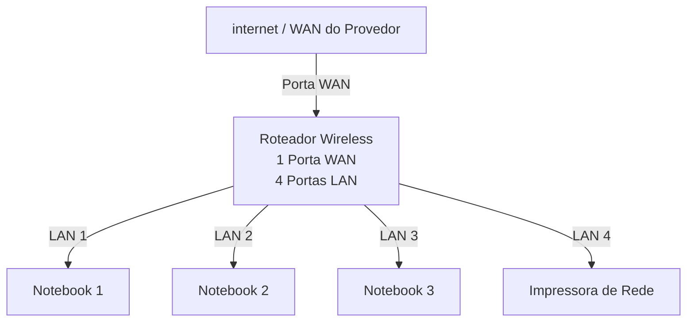

# Laboratório de redes 01 - Projeto de Rede local

Aluno: Reginaldo Soares

Professor: José de Assis

Data: 09/003/2026

---

## 1. Objetivo
Implantar uma rede local simples conectando 3 notebooks a um roteador
wireless com switch e uma impressora de rede.

O projeto será dividido em duas etapas:

1. simulação da rede no cisco packet Tracer
2. Implementação de rede no laboratório real

---

## 2. Equipamentos utilizados neste laboratório:

- 3 /notebooks
- 1 roteador wireless com 1 porta WAN e 4 portas LAN
- 1 impressora de rede
- cabos de rede

---

## 3. Topologia da Rede

Diagrama lógico da rede usada neste laboratório.

## Imagem da topologia usada neste laboratória:

---

